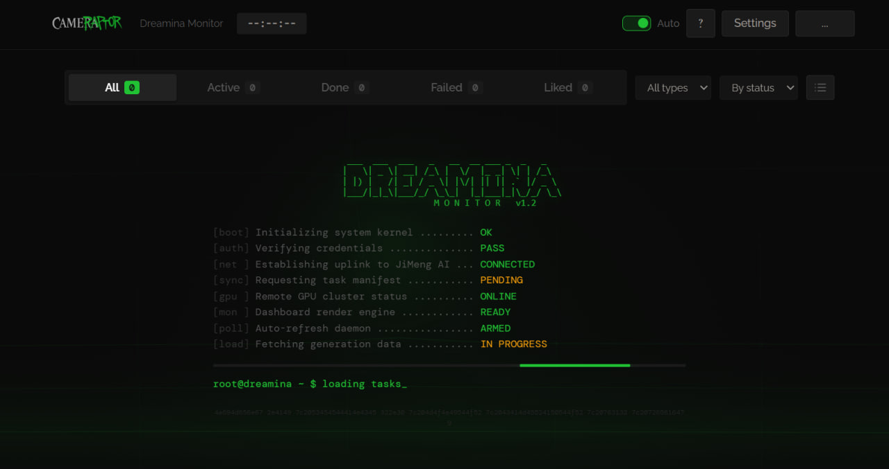
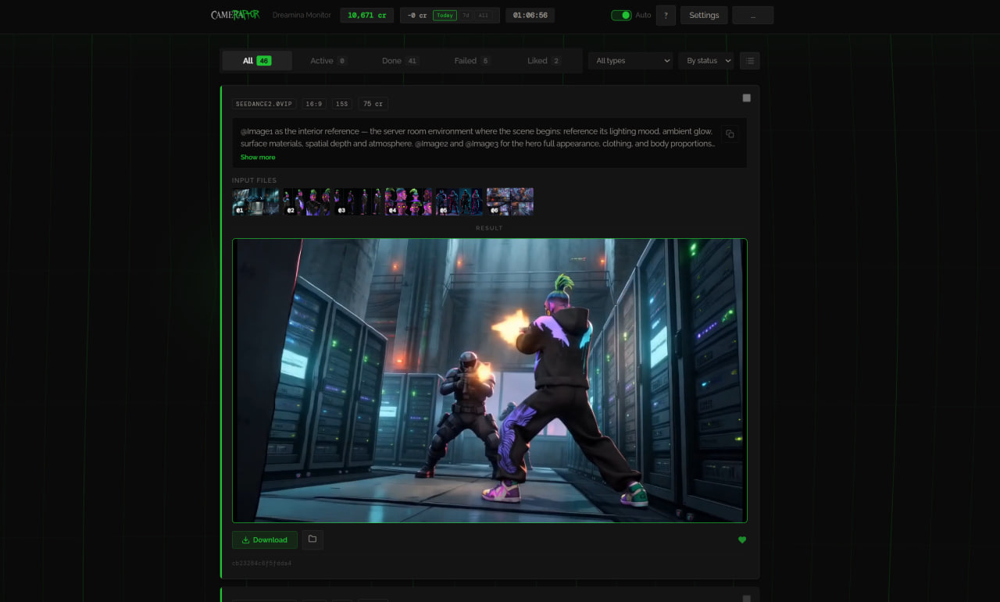
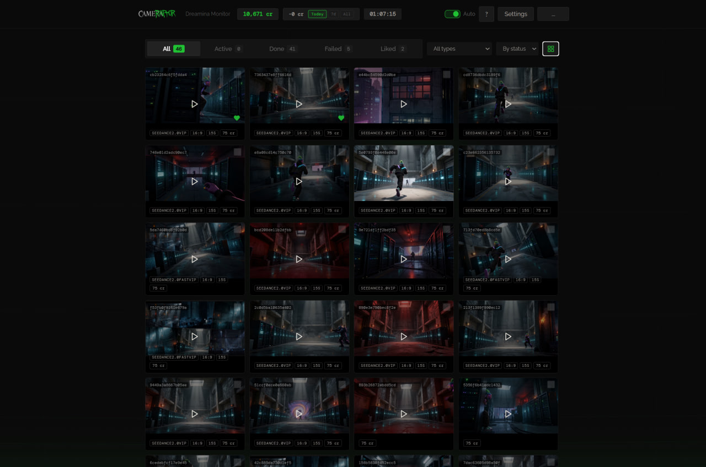

[](https://github.com/Cameraptor)
[](LICENSE)
[](https://nodejs.org)
[]()
[](https://t.me/voogieboogie)

# Dreamina Monitor — Real-Time AI Generation Dashboard

### The missing interface for [JiMeng / Dreamina](https://jimeng.jianying.com/) that ByteDance should have built.

> One file. Zero dependencies. Self-configuring. Works on any OS.
> Submit Seedance 2.0 / JiMeng generations from your IDE agent, monitor everything live, download results — all without touching the clunky web UI.

**Author:** Voogie | **Project:** [Cameraptor](https://cameraptor.com/voogie)

---



---

## The Problem

**The official JiMeng web interface is painful:**
- Slow, laggy, constantly reloading
- No batch operations — download one file at a time
- Can't see which prompt produced which result
- No reference image preview on completed tasks
- No credit tracking per session
- Terrible on smaller screens
- Impossible to use from an AI coding agent

**Dreamina CLI is powerful but blind:**
- You submit a task and get a `submit_id`
- Then you manually run `query_result` over and over
- No visual feedback, no queue position, no thumbnails
- Forget which files you used as references? Too bad.

---

## The Solution

**Dreamina Monitor** turns your localhost into a mission control center:

```bash
node monitor.js
# → http://localhost:3333
```



*Every generation card shows: model, ratio, duration, credit cost, full prompt, all input reference files as clickable thumbnails, video result with inline playback, download + like buttons.*

---

## Why This Is Better Than the Official Web UI

| | JiMeng Web UI | Dreamina Monitor |
|---|---|---|
| **Speed** | Slow page loads, React hydration lag | Instant — static HTML served from localhost |
| **Queue visibility** | "Processing..." and hope | Exact queue position #4,231 / 141,681 + ETA |
| **Reference files** | Gone after submit | Thumbnails of all input images/videos on every card |
| **Batch download** | Click... wait... click... wait... | Lasso-select 20 results → download all at once |
| **Credit tracking** | Buried in account page | Always visible in header + session spending breakdown |
| **Prompt history** | Scroll through a feed | Full prompt on every card with copy button |
| **Agent integration** | None | Submit from Claude Code / Cursor / Windsurf / any IDE |
| **Notifications** | Check the tab manually | Sound beep + push notification when done |
| **Likes & favorites** | None | Heart your best results, filter by Liked tab |
| **Compare results** | Open multiple tabs | Gallery grid — 24+ thumbnails on one screen |
| **Works offline** | No | Dashboard works without internet (shows cached tasks) |
| **Open source** | No | MIT licensed, single file, read every line |

---

## Every Feature, Listed

### Real-Time Monitoring
- **Auto-refresh** every 15/30/60 seconds — flicker-free DOM diffing
- **Live queue position** with progress bar + ETA countdown
- **Processing shimmer** animation for active tasks
- **Dynamic tab title** — `(3 active) Dreamina Monitor` — see status without switching tabs
- **Sound alerts** — distinct beeps for success and failure (Web Audio, no files)
- **Push notifications** — browser notification when a generation completes in background tab
- **Session timer** — running clock showing total session duration
- **Credit balance** — always visible in the header bar

### Cards & Content
- **Full prompt** on every card with expand/collapse and one-click copy
- **Input file thumbnails** — all reference images and videos shown as clickable previews
- **Video inline playback** — hover to play, click for fullscreen lightbox
- **Image lightbox** — fullscreen viewer with arrow key navigation
- **Model info** — Seedance 2.0 VIP, ratio, duration displayed as chips
- **Credit cost** per task (estimated for queued, actual for completed)
- **Task ID** — click to copy submit_id for CLI use
- **Status indicators** — color-coded dots (green/yellow/red) + status text

### Views
- **Expanded view** — full card with all details, prompt, inputs, result
- **Gallery grid** — compact thumbnail grid for visual scanning
- **Filter tabs** — All / Active / Done / Failed / Liked
- **Type filter** — dropdown to filter by generation type
- **Sort** — by status priority, newest, or oldest
- **Ghost filtering** — zombie tasks auto-detected and collapsible

### Download & Workflow
- **One-click download** — download result to default folder
- **Save As** — choose destination with native directory browser
- **Batch select** — lasso drag or Shift+click to select multiple cards
- **Batch download** — download all selected results at once
- **Retry failed** — one click copies prompt for resubmit
- **Hide zombie tasks** — clean up stuck/cancelled generations
- **Likes** — heart any generation, persists across sessions
- **Download all liked** — batch export your favorites

### Design
- **Hacker boot sequence** — ASCII art + terminal-style startup with animated status lines
- **Breathing radar grid** — animated canvas background, auto-pauses when tab hidden
- **Dark theme** — purpose-built for long sessions — Raptor Green (#21C134) on deep black
- **Embedded fonts** — Cormorant Garamond, Raleway, DM Mono
- **Cameraptor branding** — custom embedded logo and favicon
- **Responsive** — works on 13" laptops to 32" monitors

---



*Gallery grid: scan all your generations at a glance. Each thumbnail shows model, ratio, duration, cost. Hover to play videos. Green hearts = liked.*

---

## Quick Start

### 1. Install Node.js (if you don't have it)

Download from [nodejs.org](https://nodejs.org/) — version 20 or higher.

### 2. Clone & Run

```bash
git clone https://github.com/Cameraptor/Dreamina-CLI-Monitor-For-Jimeng-.git
cd Dreamina-CLI-Monitor-For-Jimeng-

node monitor.js
```

### 3. Open Dashboard

Navigate to **http://localhost:3333** in your browser.

**That's it.** No `npm install`. No build step. No config. One file = one app.

### First Launch Auto-Setup

On first run, the monitor automatically:

1. Detects your OS (Windows / macOS / Linux + ARM64)
2. Checks for Dreamina CLI — **downloads and installs it if missing**
3. Verifies login — shows setup banner with instructions if needed
4. Starts polling for your generations

---

## The Agent Superpower

The real magic happens when you combine Dreamina Monitor with AI coding agents.

### The Workflow

```
You (in IDE) → AI Agent → Dreamina CLI → JiMeng API
                                              │
              Dreamina Monitor ◄──────────────┘
              (localhost:3333)    reads CLI logs
```

1. **Prompt** — ask your AI agent to write a Seedance 2.0 prompt (or use the `seedance` skill)
2. **Submit** — agent runs `dreamina text2video --prompt="..." --model=seedance2.0vip`
3. **Monitor** — generation appears on dashboard in real-time
4. **Review** — play the video, check reference images, compare with other results
5. **Iterate** — tweak the prompt in your agent, resubmit, compare in gallery grid
6. **Export** — download the best results with one click

**You never leave your IDE.** The monitor is your visual feedback loop.

### Compatible Agents & IDEs

| Agent / IDE | How to use |
|-------------|-----------|
| **Claude Code** | `seedance` skill for prompts + `dreamina` skill for CLI |
| **Cursor** | Run CLI commands in terminal, monitor in browser |
| **Windsurf** | Same — any agent that can run shell commands |
| **GitHub Copilot** | Terminal commands via chat |
| **Codex CLI** | Direct CLI access |
| **Any terminal** | `dreamina text2video --prompt="..."` |

---

## Architecture

```
monitor.js (~2700 lines — literally the entire application)
│
├── Node.js HTTP Server (port 3333, localhost only)
│   ├── GET  /                    → full dashboard (embedded HTML/CSS/JS)
│   ├── GET  /api/status          → all tasks with enriched details
│   ├── GET  /api/credits         → JiMeng account balance
│   ├── GET  /api/thumb?path=...  → serve local input file thumbnails
│   ├── POST /api/track-inputs    → link reference files to task
│   ├── POST /api/download        → download generation result
│   ├── POST /api/like            → toggle task like
│   ├── GET  /api/liked           → list of liked task IDs
│   ├── GET  /api/settings        → user preferences
│   ├── POST /api/settings        → update preferences
│   ├── GET  /api/setup-status    → health check (Node, CLI, auth)
│   └── GET  /api/favicon         → embedded Cameraptor icon
│
├── Auto-Tracker (runs every 3 seconds)
│   └── Parses ~/.dreamina_cli/logs/ → extracts model, ratio, duration, input files
│
└── Frontend (zero external dependencies)
    ├── Embedded CSS (dark theme, responsive, animations)
    ├── Embedded JS (fetch, DOM diffing, lightbox, canvas)
    └── Embedded assets (logo SVG, favicon PNG, font links)
```

### Design Decisions

| Decision | Why |
|----------|-----|
| **Single file** | Zero setup. `node monitor.js` and done. Share with anyone. |
| **No npm** | No node_modules, no package.json, no supply chain risk |
| **No framework** | Vanilla Node.js HTTP server. No Express, no React. |
| **No Electron** | 150MB Electron bundle vs 1.1MB monitor.js |
| **Localhost only** | Security: never exposed to network. Your data stays local. |
| **HTML as string array** | No template engine needed. Concat and serve. |

---

## Configuration

Click **Settings** in the dashboard header:

| Setting | Options | Default |
|---------|---------|---------|
| Auto-refresh interval | 15s / 30s / 60s / Off | 30s |
| Download directory | Any local folder | ~/Downloads |

Settings persist in `monitor-settings.json` (auto-created on first change).

---

## File Reference

| File | Purpose | Created |
|------|---------|---------|
| `monitor.js` | The entire application | Manual |
| `monitor-settings.json` | User preferences | Auto |
| `task-inputs.json` | Tracked generation inputs (model, ratio, files) | Auto |
| `hidden-tasks.json` | IDs of hidden zombie tasks | Auto |
| `liked-tasks.json` | IDs of liked tasks | Auto |
| `DREAMINA_CLI.md` | Complete Dreamina CLI reference (Russian) | Manual |
| `ROADMAP.md` | Project roadmap v1.0 → v2.0 | Manual |

---

## For AI Agents — Self-Setup Guide

If you are an AI agent reading this repository:

1. **To run the monitor:** `node monitor.js` — it self-configures on first launch
2. **To submit a generation:** use `dreamina` CLI (see [DREAMINA_CLI.md](DREAMINA_CLI.md))
3. **To write prompts:** reference files in `skills/seedance/` for Seedance 2.0 prompt patterns
4. **The dashboard** is at `http://localhost:3333` — tell the user to open it
5. **All JSON files** (`task-inputs.json`, etc.) are auto-managed — do not edit manually
6. **CLAUDE.md** contains system rules if you need project-level guidance

### Key CLI Commands

```bash
# Check CLI is installed
dreamina --version

# Login (opens browser)
dreamina login

# Check credits
dreamina user_credit

# Submit video generation
dreamina text2video \
  --prompt="your prompt here" \
  --model=seedance2.0vip \
  --ratio=16:9 \
  --duration=15

# Submit with reference images
dreamina img2video \
  --prompt="@Image1 as environment..." \
  --image="path/to/ref1.jpg" \
  --image="path/to/ref2.jpg" \
  --model=seedance2.0vip

# Check result
dreamina query_result --submit_id=<id> --download_dir="./output"
```

---

## Companion Projects

| Project | What it does |
|---------|-------------|
| [Seedance 2.0 ComfyUI Node](https://github.com/Cameraptor/seedance_2_Comfy_UI_Node-sjinn_Api-) | Generate Seedance 2.0 videos in ComfyUI workflows via Sjinn.ai |
| `skills/seedance/` (included) | Claude Code skill for Seedance 2.0 prompt engineering |
| `skills/dreamina/` (included) | Claude Code skill for Dreamina CLI operations |

---

## Supported Platforms

| Platform | Status |
|----------|--------|
| Windows 10/11 (x64) | Fully supported — primary dev platform |
| macOS Intel | Supported |
| macOS Apple Silicon (M1/M2/M3/M4) | Supported — auto-detects ARM64 |
| Linux x64 | Supported |

---

## Roadmap

| Version | Status | What |
|---------|--------|------|
| **v1.0** | Done | Dashboard, cards, filters, gallery, lightbox, batch download, branding |
| **v1.1** | Done | Settings, likes, sound notifications, session stats, breathing radar grid |
| **v1.2** | Done | Cross-platform, self-configuring, auto-download CLI, health checks |
| **v1.3** | Next | Standalone `.exe` / binary — double-click to run, no Node.js needed |
| **v2.0** | Planned | Side-by-side comparison, tags, prompt search, auto-download, WebSocket |

Full details in [ROADMAP.md](ROADMAP.md).

---

## Troubleshooting

| Problem | Solution |
|---------|----------|
| Port 3333 in use | Kill other process: `taskkill /F /IM node.exe` (Win) or `pkill -f monitor` (Mac/Linux) |
| CLI not found | `curl -s https://jimeng.jianying.com/cli \| bash` then restart terminal |
| Not logged in | `dreamina login` — opens browser for authentication |
| No tasks showing | Submit something first: `dreamina text2video --prompt="test" --model=seedance2.0vip` |
| Thumbnails missing | Reference files must exist at original paths on disk |
| 403 on thumbnails | Files outside home directory — monitor auto-allows paths from task-inputs.json |

---

## Support & Community

- **Telegram:** [Join @voogieboogie](https://t.me/voogieboogie) — help, workflows, creative discussion
- **Issues:** [GitHub Issues](https://github.com/Cameraptor/Dreamina-CLI-Monitor-For-Jimeng-/issues)
- **Website:** [cameraptor.com/voogie](https://cameraptor.com/voogie)

---

## Legal & Compliance

**Dreamina Monitor is 100% legal and does not violate JiMeng/Dreamina platform rules.**

- **Uses only the official Dreamina CLI** — a tool published and maintained by JiMeng (ByteDance) themselves at [jimeng.jianying.com/cli](https://jimeng.jianying.com/cli), specifically designed for programmatic access
- **No reverse engineering** — the monitor reads CLI log files and calls the same public API endpoints the CLI itself uses
- **No scraping** — no interaction with the JiMeng web interface whatsoever
- **No credential theft** — authentication is handled entirely by `dreamina login`, the official flow
- **Personal use tool** — this is a convenience dashboard for your own account, your own generations, your own files
- **The CLI exists for exactly this purpose** — ByteDance published the CLI so developers and creators can integrate JiMeng into their workflows. Dreamina Monitor is that workflow.

This project is not affiliated with ByteDance, JiMeng, or Dreamina. It is an independent open-source tool that enhances the experience of using the official CLI.

---

## License

MIT License — see [LICENSE](LICENSE) file for details.

---

**Made with raptor energy by Voogie**

[](https://t.me/voogieboogie)

Star this repo if you find it useful!

---

<p align="center">
  <a href="https://cameraptor.com/voogie">
    
  </a>
</p>
